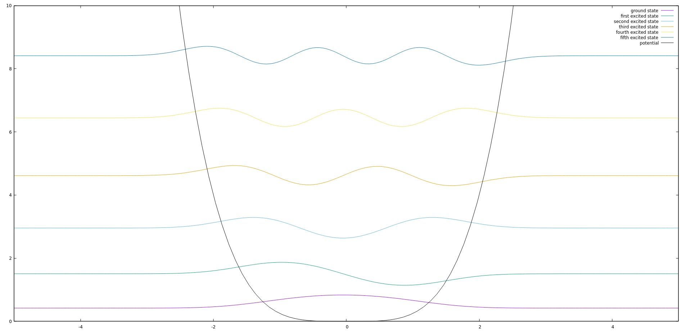

# Schrödinger-Equation
Using verlet method to solve the Schrödinger equation for an arbitrary potential and bisection method to solve for eigen-energies

## Getting Started
To change code and potentials, currently refer to `verlet.cpp` under src, the main function here solves for an eigen-energy within some bounds and outputs the numerical solution due to verlet. To compile the file into an executable use `build.sh`, to compile and output to a `.csv` file run `run.sh` with an argument for the filename (including extension).

## Background

### Verlet Method

The Verlet method is a method for numerically solving a second order differential equation (typically of a specific form, which is what is used here).

It achieves a greater degree of numerical accuracy than Euler's method typically does, and is relatively simple in comparison to Runge-Kutta.

Let us say that we have a differential equation of the form:

```math
\ddot y = f(y(t))
```
Or, in the case here:

```math
\frac{d^2}{dx^2} y = f(y(x))
```

Then, for example, with initial conditions $y(0) = c_1$ and $y'(0) = c_2$, Verlet can be intialized with:

```math
\begin{equation}
\tag{1}
y(\Delta x) = y(0) + y'(0) \Delta x + \dfrac 1 2 f(y(0)) \Delta x^2
\end{equation}
```

And then, after initialization, verlet can run with:

```math
\begin{equation}
\tag{2}
y(x + \Delta x) = 2y(x) - y(x - \Delta x) + f(y(x)) \Delta x^2
\end{equation}
```

In the case of this project, we calculate two "positions" or initial conditions in $y$ using a function that approximates the value of a solution to the Schrödinger equation and use begin with equation (2). 

### Schrödinger Equation

The Schrödinger equation describes wave-function and its time evolution of a particle according to an "environment" parametrized by a potential function, and additionally parametrized by the energy of the particle.

The time-independent Schrödinger equation describes the "standing waves" of the Schrödinger equation coming from wave-particle duality. Since the Schrödinger equation is a wave equation (a hyperbolic PDE to be exact), there are standing wave solutions which solve an eigenvalue problem when seperation of variables is applied. These functions can be used to solve the time-dependent version of the Schrödinger equation for an arbitrary state which is seen as a superposition of other, standing-wave states alongside a temporal component.

The time-independent Schrödinger equation is what is examined here, and it has the form:
```math
\begin{equation}
\tag{3}
{\bf \hat H} \ket{\psi} = E \ket \psi
\end{equation}
```
In dirac notation, where ${\bf \hat H}$ is the Hamiltonian operator, $\ket \psi$ is a state/solution to the equation and $E$ is an eigen-energy, as a mathematical equation this translates to:
```math
\begin{equation}
\tag{4}
\left(-\frac{\hbar^2}{2m} \frac{d^2}{dx^2} + V(x)\right) \psi(x) = E\psi(x)
\end{equation}
```
Where $V(x)$ is the potential function, which essentially describes the environment/system the particle is interacting with. If we set $\hbar = 1$ and $m = 1$ for simplicity then this becomes:
```math
\begin{equation}
\tag{5}
\left(-\frac{1}{2} \frac{d^2}{dx^2} + V(x)\right) \psi(x) = E\psi(x)
\end{equation}
```

If we rearrange terms, this becomes:
```math
\begin{equation}
\tag{5}
\frac{d^2}{dx^2} \psi(x) = 2(V(x) - E)\psi(x)
\end{equation}
```

Which is the equation we use to solve this with verlet given a potential $V(x)$ and an energy $E$.

There are restrictions on what constitutes a "valid" solution, namely the condition that $\lim_{x \to \pm \infty} \psi(x) = 0$ when the potential has $\lim_{x\to \pm \infty}V(x) = \infty$, which are the only potentials we examine in this project.

### Bisection Method
The bisection method is an algorithm for finding roots to a polynomial on an interval which serves as input to the algorithm. Here, however, we adapt it to use it for the Schrödinger equation and solve for eigen energies to equation (5) subject to the constraints.

A notable problem encountered and solved in this project is the adapted bisection method not necessarily converging to the eigen-energy due to the parity of the energy. To describe the parity of an energy, let $E_0$ be the ground-state energy (smallest eigen-energy), it is an even energy because it is the $0$th energy, the first excited state has energy $E_1$ which has an odd parity, because it is the $1$st energy, etc.

The bisection method has two implementations an even and an odd one, where variants will converge to even and odd energies respectively. Using this, we can make a function that decides between the two methods based on which converges correctly and more accurately towards a valid eigen-energy to solve for it, given good bounds.

A caveat is that the bounds input to the bisection method should ideally not contain two eigen-energies, and qualitative analysis (at least now) will be needed to determine if this is the case. 

## Solving the Schrödinger equation

The code for the Verlet algorithm is in `verlet.cpp` and `verlet.h`. The code for the Schrödinger equation is found in `schrodinger.cpp` and `schrodinger.h`, which describe a `Schrodinger` class that essentially contains a potential and an energy as well as several necessary functions. The bisection method is in `bisection.cpp` and `bisection.h`. 

The way this works is that, the bisection method is first used to solve for an eigen-energy (in some interval $[a,b]$, where the eigen-energy is guessed to be in that in interval). The bisection method uses Verlet algorithm to essentially solve the Schrödinger equation numerically with an eigen-energy and determine whether the solution diverges or not by the end, and using whether it diverges to positive or negative infinity narrow down what the energy is. Then, this eigen-energy is returned and cast to an energy, whereupon a `Schrodinger` object has its energy set to whatever was output by the bisection, with the same potential given to the bisection method. This object is used in Verlet, where the normalization constant is found (as wavefunctions must be normalized) and the solution is output with the energy added as an offset currently.

Managing the output and outputting data to files is handled by shell scripts, notably `run.sh`, which output the data to a `.csv` file.

This data can then be graphed with ease.

## Quartic Potential

The quartic potential, or:
```math
V(x) = \frac 1 4 x^4
```
when put into the Schrödinger equation does not have an analytic solution, hence numerical methods reign supreme here. After running the algorithm and solving for the eigen-energies we get this graph showing the different states and their energies (added as offsets to the eigen-functions to illustrate how the potential affects the solution)


